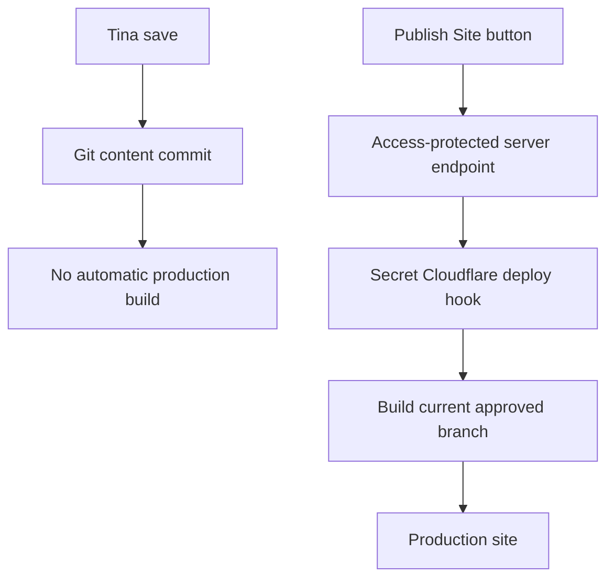

# Tina Authoring and Publishing Feasibility

Last updated: 2026-08-06
Scope: Sprint 8B technical findings and approved implementation direction

Sprint 12A result: the recommended string-body editor spike was implemented on
2026-08-06. Tina parse/serialize/reopen tests preserve the representative
Markdown and existing `<YouTube />` source, local schema generation exposes the
body as a string, and the Astro build passes. Hosted Tina save/reopen review is
the remaining rollout gate.

## Result

Both requested workflows are feasible without replacing Astro or TinaCMS:

- Content Entry bodies can use a plain Markdown textarea/editor with a rendered
  preview while remaining the body of the existing `.mdx` files.
- Tina can show a **Publish Site** control that calls a protected server-side
  endpoint. Cloudflare Pages can ignore routine production-branch commits and
  build only when that endpoint invokes a deploy hook.

Neither feature should place a deploy-hook URL, GitHub credential, or Cloudflare
API token in Tina's browser bundle.

## Markdown-first authoring

### Supported foundation

Tina supports `isBody` on both `string` and `rich-text` text fields. A string
body can therefore preserve plain Markdown in the file body rather than
serializing it into frontmatter. Tina also allows a React component to fully
replace a field's default editor UI.

Official references:

- [Tina field reference](https://tina.io/docs/reference/fields)
- [Tina custom field components](https://tina.io/docs/extending-tina/custom-field-components)
- [Tina rich-text behavior](https://tina.io/docs/reference/types/rich-text)

### Recommended implementation spike

1. Clone one representative Content Entry as a draft fixture containing
   headings, links, absolute images, lists, a table, fenced code, and the current
   YouTube MDX component.
2. Change only the fixture collection/body implementation to a `string` body
   with a custom React component.
3. Present a split or toggled interface: source Markdown textarea and sanitized
   rendered preview.
4. Save, reopen, compare the raw file, and run the Astro build.
5. Test an imported Google Docs Markdown export and report unsupported syntax.

The existing MDX YouTube component is the important compatibility case. Plain
Markdown will be the default, but existing MDX must round-trip without being
silently rewritten. If the string-body spike cannot preserve current MDX, the
fallback is a customized rich-text field with Tina's Raw Markdown toolbar mode,
not a lossy migration.

### Import boundary

Tina's Media Manager can accept `.md` files as assets, but that does not create
a fully modeled Content Entry. Import should therefore be an explicit local or
server-side parser that:

- reads `.md` or `.mdx`
- separates body and frontmatter
- maps known metadata
- asks for missing title, summary, date, section, tags, draft, and cover image
- validates absolute links/images and rejects unsafe filesystem paths
- writes one canonical `.mdx` entry

The first version should treat inline YouTube conversion as optional, matching
the approved requirement.

## Upload-or-URL images

Tina's repository media store should remain available for ordinary uploads.
Tina also supports custom field components, so image-bearing fields can share a
small source selector:

- `Managed upload` uses the existing Tina image picker.
- `External URL` accepts a validated public `https://` image URL, including
  Immich-hosted assets.

The stored value can remain a string, which Astro already renders for cover,
header, tile, and inline images. Validation should permit only `https://` for
external sources and should show a preview/error before save.

An Immich album share URL remains a separate gallery control; it is not an
individual image source.

Official reference: [Tina repository media](https://tina.io/docs/reference/media/repo-based).

## Deliberate publishing

### Recommended architecture

Cloudflare Pages can disable automatic production-branch deployments and can
create a deploy hook tied to a chosen branch. The hook URL accepts POST requests
without its own authentication, so Cloudflare explicitly says it must be
protected like a secret.

Tina custom components run in a statically built browser app. Tina documents
that public-prefixed environment values are embedded in that JavaScript; a
deploy hook must never be passed through one of those variables.

The safe design is:

1. Keep Tina saves on the current approved content branch.
2. Disable automatic production deployments for that branch in Cloudflare.
3. Create a branch-specific Cloudflare Pages deploy hook.
4. Store the hook URL only as a server-side Pages Function/Worker secret.
5. Protect `/api/publish` with Cloudflare Access for Patrick's allowed identity.
6. Add a Tina custom control that POSTs to `/api/publish` and reports idle,
   publishing, success, and failure states.
7. Rate-limit or reject concurrent requests and log the initiating identity and
   response ID where available.

Official references:

- [Cloudflare branch deployment controls](https://developers.cloudflare.com/pages/configuration/branch-build-controls/)
- [Cloudflare deploy hooks and security](https://developers.cloudflare.com/pages/configuration/deploy-hooks/)
- [Tina custom field components and environment behavior](https://tina.io/docs/extending-tina/custom-field-components)

### Alternative: Tina Editorial Workflow

TinaCloud's Editorial Workflow saves protected-branch edits to a new branch and
opens a draft pull request. Publishing then requires merging that pull request
through GitHub. This is a sound review workflow, but it does not match the
requested one-button editing session as closely and adds branch/PR management
for a single owner.

Official reference: [Tina Editorial Workflow](https://tina.io/docs/tinacloud/editorial-workflow).

### Configuration dependencies

The Publish workflow requires owner access to Cloudflare Pages settings to:

- disable automatic production-branch deployments
- create the deploy hook
- store its URL as a server-side secret
- create an Access policy for the publish endpoint

Until the protected endpoint is deployed and tested, automatic deployments
must remain enabled so the existing publishing workflow is not interrupted.

## Feasibility verdicts

| Requirement | Verdict | Principal risk | Gate |
| --- | --- | --- | --- |
| Plain Markdown editor | Feasible | Existing MDX AST/components may not round-trip through a string body | Draft fixture round-trip test |
| Live preview | Feasible | Preview sanitation and parity with Astro rendering | Shared rendering test corpus |
| Markdown import | Feasible | Google Docs export quirks and unsupported MDX | Parser/validator fixture set |
| Immich image URL | Feasible | Share-page URLs are not always direct image URLs | Validate and preview final asset URL |
| Tina Publish button | Feasible | Static admin cannot keep secrets | Access-protected server relay |
| No build per save | Feasible | Disabling builds before manual trigger works would halt publishing | Deploy hook smoke test before disabling automatic builds |
